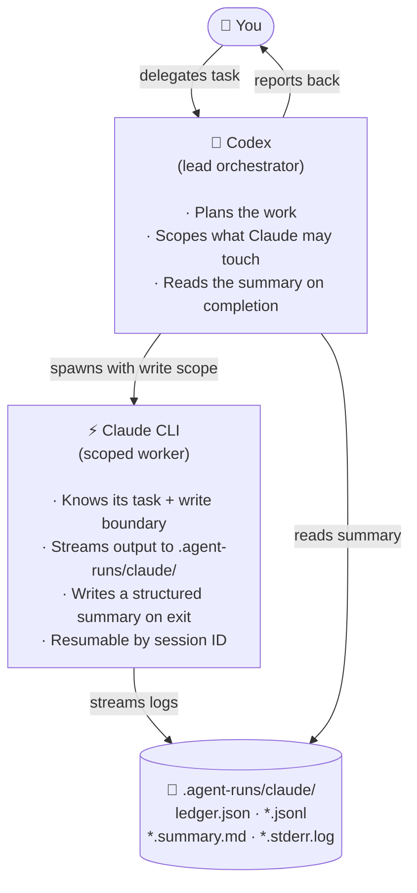

# codex-claude-subagents

**Codex leads. Claude works. Logs stay out of git.**

A [Codex](https://github.com/openai/codex) skill that lets Codex orchestrate Claude CLI as resumable, scoped subagents — each worker runs with an explicit write scope, streams structured logs to `.agent-runs/claude/`, and can be resumed by session ID if interrupted.

[](LICENSE)
[](https://www.python.org/)
[](https://docs.anthropic.com/en/docs/claude-code)

---

## Why

Codex and Claude are both capable agents, but they have different strengths. Codex excels at orchestration, planning, and driving multi-step workflows. Claude excels at deep reasoning, careful edits, and long-horizon tasks.

This skill wires them together cleanly:



No framework, no extra packages — stdlib only.

---

## Install

```bash
cp -R skills/claude-subagents ~/.codex/skills/
```

Restart your Codex session after installing — Codex discovers skills at session start.

**Requirements**

- [Codex CLI](https://github.com/openai/codex) installed
- [Claude CLI (Claude Code)](https://docs.anthropic.com/en/docs/claude-code) installed and authenticated (`claude --version`)
- Python 3.9+

---

## Quickstart

### Read-only audit

```bash
python3 ~/.codex/skills/claude-subagents/scripts/run_claude_subagent.py \
  --task audit-security \
  --prompt examples/prompts/read-only-audit.md
```

### Scoped fix

```bash
python3 ~/.codex/skills/claude-subagents/scripts/run_claude_subagent.py \
  --task fix-auth \
  --prompt examples/prompts/scoped-fix.md \
  --write-scope src/auth
```

### Resume an interrupted run

```bash
python3 ~/.codex/skills/claude-subagents/scripts/run_claude_subagent.py \
  --task fix-auth \
  --prompt examples/prompts/scoped-fix.md \
  --session-id <session-id-from-ledger> \
  --write-scope src/auth
```

Session IDs are stored in `.agent-runs/claude/ledger.json` after each run.

---

## How to use from inside Codex

Once the skill is installed, Codex picks it up automatically. Ask Codex things like:

> "Run a security audit on this repo using the Claude subagent skill."

> "Delegate the auth refactor to a Claude worker scoped to `src/auth`."

Codex will invoke the launcher, wait for the summary, and report back.

---

## CLI reference

```
run_claude_subagent.py [options]

Required:
  --task   <id>       Stable kebab-case task identifier (used for log filenames)
  --prompt <file>     Markdown prompt file to send to the worker

Optional:
  --write-scope <dir> Directory the worker may edit (repeatable; omit = read-only)
  --session-id  <id>  Resume a previous Claude session
  --model       <m>   Claude model (default: sonnet)
  --effort      <e>   Reasoning effort: low|medium|high|xhigh|max (default: high)
  --permission-mode   Claude permission mode (default: acceptEdits)
  --cwd         <dir> Working directory for the Claude run (default: .)
  --name        <n>   Display name for the session (default: task id)
```

---

## Log layout

All logs are written to `.agent-runs/claude/` in the working directory. This path is automatically added to `.gitignore`.

| File | Contents |
|---|---|
| `ledger.json` | Index of all runs — task, session ID, timestamps, exit code |
| `<task>.jsonl` | Streaming structured output from Claude |
| `<task>.stderr.log` | stderr from the Claude process |
| `<task>.prompt.md` | Full injected prompt (worker contract + your prompt) |
| `<task>.summary.md` | Final summary written by the Claude worker |

---

## Worker contract

Every prompt is prepended with a contract that tells Claude:

- Codex is lead orchestrator; Claude is a scoped worker
- Writes are restricted to `--write-scope` (or read-only if unset)
- Structured output goes to logs; don't summarize to stdout
- Write a compact summary to `.agent-runs/claude/<task>.summary.md`
- Summary must include: Outcome, Files Inspected, Files Changed, Verification, Risks, Next

This contract is injected automatically — your prompt file only needs the task description.

---

## Example prompts

Ready-made prompts live in `examples/prompts/`:

| Prompt | Use case |
|---|---|
| `read-only-audit.md` | Security audit — no writes, structured findings table |
| `scoped-fix.md` | Template for a scoped fix — fill in the issue description |

---

## Limitations

- Requires Claude CLI installed and authenticated locally.
- Codex does not hot-reload skills — restart the session after `cp`.
- Broad `--write-scope` values (`.` or `/`) are unsafe; always scope to the minimum required directory.
- Session resumption depends on Claude CLI's `--session-id` support; behaviour may vary across CLI versions.

---

## Contributing

Issues and PRs welcome. Keep it stdlib-only — no new runtime dependencies.
