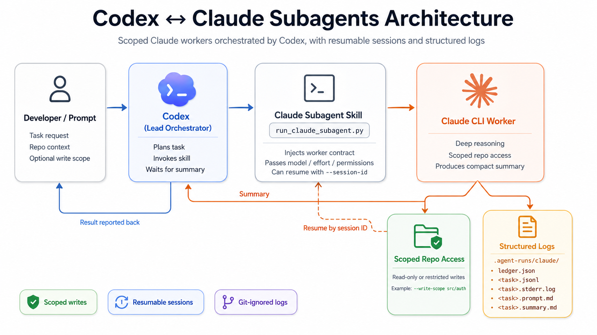

<div align="center">

# codex-claude-subagents

### Use Claude as subagents in Codex.

Spawn scoped, resumable Claude CLI workers from inside a Codex session —
no manual context-shuttling, no framework, stdlib only.

[](LICENSE)
[](https://www.python.org/)
[](https://docs.anthropic.com/en/docs/claude-code)



</div>

---

## Why

Codex orchestrates; Claude does the deep, careful work. This skill lets Codex
launch Claude CLI as a scoped worker — directory-limited, session-resumable,
every run recorded in a ledger Codex can audit or resume from later. OpenAI
ships the Codex-in-Claude-Code direction; this is the reverse.

## Install

```bash
cp -R skills/claude-subagents ~/.codex/skills/
```

Restart Codex afterward — skills are discovered at session start.

**Requires:** [Codex CLI](https://github.com/openai/codex), [Claude CLI](https://docs.anthropic.com/en/docs/claude-code) (authenticated), Python 3.9+.

## Quickstart

```bash
# read-only audit
python3 ~/.codex/skills/claude-subagents/scripts/run_claude_subagent.py \
  --task audit-security --prompt examples/prompts/read-only-audit.md

# scoped fix
python3 ~/.codex/skills/claude-subagents/scripts/run_claude_subagent.py \
  --task fix-auth --prompt examples/prompts/scoped-fix.md --write-scope src/auth

# resume by session id (see .agent-runs/claude/ledger.json)
python3 ~/.codex/skills/claude-subagents/scripts/run_claude_subagent.py \
  --task fix-auth --prompt examples/prompts/scoped-fix.md \
  --session-id <id> --write-scope src/auth
```

From inside Codex, just ask: *"Delegate the auth refactor to a Claude worker
scoped to `src/auth`."*

## CLI reference

| Flag | Required | Meaning |
|---|---|---|
| `--task` | yes | kebab-case task id — keys every log file |
| `--prompt` | yes | markdown prompt file sent to the worker |
| `--write-scope` | no | dir Claude may edit (repeatable); omit = read-only |
| `--session-id` | no | resume a previous Claude session |
| `--model` / `--effort` | no | default `sonnet` / `high` |
| `--permission-mode` | no | default `acceptEdits` — `bypassPermissions` is rejected |

## Logs and the worker contract

Every run writes to `.agent-runs/claude/` (auto-gitignored): `ledger.json`
(index — session id, status, paths), `<task>.jsonl` (stream), `<task>.summary.md`
(the worker's own report), `<task>.stderr.log`, `<task>.prompt.md`.

Every prompt is prepended with a contract: Codex leads, Claude stays inside
`--write-scope`, and the worker must leave a summary covering Outcome, Files
Changed, Verification, Risks, and Next.

## FAQ

**Can workers run in parallel?**
Yes — background multiple launcher calls with distinct `--task` ids. Ledger
writes are file-locked, so concurrent completions can't race or drop entries.

**What happens if a session is already in use?**
The run is marked `status: locked` in the ledger and exits `3`, instead of
failing silently.

**Can Codex see progress mid-run?**
No — feedback is post-hoc. Tail the task's `.jsonl` from another shell for
live visibility.

**Why is `bypassPermissions` not an option?**
Deliberately excluded. Only `default`, `acceptEdits`, and `autoEdit` are accepted.

## Contributing

Issues and PRs welcome — keep it stdlib-only, no new runtime dependencies.
