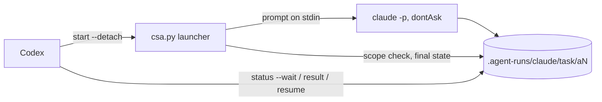

<div align="center">

# codex-claude-subagents

### Use Claude as subagents in Codex.

A Codex skill that starts Claude Code CLI workers for bounded review or implementation tasks,
enforces what they may touch, and records every run on disk. One stdlib Python script.

[](LICENSE)
[](https://www.python.org/)
[](https://code.claude.com/docs/en/cli-reference)

</div>

---

## Why

Codex orchestrates; a Claude worker gives a cross-vendor review, a second opinion, or a bounded
change in a disjoint scope. The worker runs non-interactively with explicit permissions, and
Codex polls, reads and resumes runs from files instead of holding a shell open.


```mermaid
flowchart LR
  C[Codex] -->|start --detach| L[csa.py launcher]
  L -->|prompt on stdin| W[claude -p, dontAsk]
  W --> S[(.agent-runs/claude/task/aN)]
  L -->|scope check, final state| S
  C -->|status --wait / result / resume| S
```

## Requirements

- WSL2 (Ubuntu) or Linux. The script refuses to run on Windows Python; from Windows it is
  called through `wsl.exe -e`.
- Python 3.8+, git, and an authenticated [Claude Code CLI](https://code.claude.com/docs/en/cli-reference)
  (tested with 2.1.290). `npx` and Google Chrome only for `--browser`.

## Install

Inside WSL (replace, do not merge: a merged copy keeps stale v1 files):

```bash
rm -rf ~/.codex/skills/claude-subagents && cp -R skills/claude-subagents ~/.codex/skills/
python3 ~/.codex/skills/claude-subagents/scripts/csa.py doctor
```

Codex Desktop on Windows discovers skills in `%UserProfile%\.codex\skills\`, so put the same
folder there too (replace it the same way). That copy is only read for discovery; `csa.py`
always executes from the WSL copy, which is the path `SKILL.md` tells Codex to call.

`doctor` checks every flag and option value the launcher emits against your `claude` without
any API call (it cannot validate permission-rule strings). Restart Codex afterwards; skills are
discovered at session start.

Detached runs started from Windows keep running after `wsl.exe` returns only while the distro
is up. WSL stops an idle distro after 15 s by default, so add this to `%UserProfile%\.wslconfig`
and run `wsl --shutdown` once:

```ini
[general]
instanceIdleTimeout=-1
```

## Quickstart

```bash
CSA=~/.codex/skills/claude-subagents/scripts/csa.py
REPO=/home/me/projects/app

# review (default): read-only, structured findings
python3 $CSA start --cwd $REPO --task review-auth --prompt examples/prompts/read-only-audit.md --detach

# scoped fix: edits allowed only under src/auth
python3 $CSA start --cwd $REPO --task fix-auth --mode write --scope src/auth \
  --allow-bash "pytest -q" --prompt examples/prompts/scoped-fix.md --detach

python3 $CSA status --cwd $REPO --wait 540 --json      # returns on the first transition
python3 $CSA result --cwd $REPO --task fix-auth --json
echo "Also cover the expired-token case." | python3 $CSA resume --cwd $REPO --task fix-auth --prompt -
python3 $CSA cancel --cwd $REPO --task review-auth
```

The two prompts in [`examples/prompts/`](examples/prompts) are sent to the worker verbatim:
`read-only-audit.md` fits the default review mode (findings come back as `structured_output`),
and `scoped-fix.md` is a write-mode template whose Issue section you replace before running.
Add `--worktree` when another run is active in the same working tree.

From Windows Codex Desktop (PowerShell), the same verbs:

```powershell
wsl.exe -d Ubuntu-22.04 -e python3 /home/me/.codex/skills/claude-subagents/scripts/csa.py status --cwd /home/me/projects/app --json
```

From inside Codex, just ask: *"Have a Claude worker review my uncommitted changes."*
[`SKILL.md`](skills/claude-subagents/SKILL.md) is the full operating guide Codex follows.

## What is enforced

| Concern | How |
|---|---|
| No prompts, no hangs | `--permission-mode dontAsk`: anything not pre-approved is denied |
| Review is read-only | Edit/Write/NotebookEdit removed; Bash runs Claude Code's built-in read-only commands (`cat`, `grep`, `find`, read-only `git`, ...; not configurable) plus a read-only allowlist and your `--allow-bash` prefixes |
| Writes stay in scope | `Edit(/<scope>/**)` allow rules; a post-run git check (working tree, index, commits) flags any other git-visible change as `scope-violation` (never reverted); a `--scope` inside a submodule is refused |
| Reads stay in the repo | `blockReadsOutsideWorkingDirectories`: file tools and read-only Bash refuse paths outside `--cwd` |
| Egress tools denied | WebFetch, WebSearch, DesignSync, PushNotification, RemoteTrigger, SendMessage, Monitor, ScheduleWakeup, EnterWorktree and Workflow are denied (a deny beats any allow rule); cron and background tasks off. This is not network isolation: see below |
| Narrow, pinned browser | `--browser` runs `@playwright/mcp@0.0.83` with its navigation and input tools only; code execution, local-file reads and every tool that takes a `filename` (it can write anywhere in the repo) are denied. It is network access |
| One writer per tree | a write run is refused while any other run is active in the main working tree, and a review while a writer is; use `--worktree` (`.agent-runs/wt/<task>`, branch `csa/<task>`) |
| Hooks, MCP, memory off | `disableAllHooks`, MCP only from `--mcp-config`, auto memory off |
| Bounded cost and time | `--max-turns 80`, `--budget-usd 5`, `--timeout-min 45` by default (finite) |
| Nothing left running | when the worker exits, its process group gets SIGTERM, then SIGKILL, and must be empty before the final snapshot and the lock release; `cancel` signals only the attempt it marked |
| Honest status | `complete` needs exit 0 (unknown if the launcher was lost) + a `success` result without `is_error` + a clean scope check; a dead run without a result is `interrupted`; a run never stays `running` because its files cannot be read |
| Clean git | `.agent-runs/` goes into `.git/info/exclude`; `.gitignore` is never edited |

Not a sandbox: `--allow-bash` commands are trusted code. They, and whatever they run (a test
suite's `conftest.py`, a build script), have network access and your full user permissions;
Edit/Write rules do not bind them. The scope check sees only what git sees: not ignored files,
`.git` internals, paths outside the repo, edits inside an already-dirty submodule, or changes
undone before the run ends.

Not isolated: the worker still loads your user and project `CLAUDE.md`, plugins and skills,
the `env` and `model` from your settings, and allow rules from every settings file, including a
repo's own `.claude/settings.json`. Denies always win, but an allow rule there (for example
`Bash(curl:*)`) does apply. Review untrusted repos with that in mind.

Each task keeps `run.json` plus one append-only `a<N>/` directory per attempt (`prompt.md`,
`stream.jsonl`, `stderr.log`, `result.md`, `result.json`, `changes.json`).

## Upgrading from v1

`run_claude_subagent.py` is gone. `--write-scope X` becomes `--mode write --scope X`; resuming
with `--session-id` becomes the `resume` verb; there is no `summary.md` (the worker's final
message is the result) and no shared `ledger.json` (an old one is reported and ignored).
`--model` is passed through verbatim and nothing is defaulted.

## Development

```bash
python3 -m unittest discover -s tests -v
```

The tests use a fake `claude` on `PATH` and recorded real streams in `tests/fixtures/`
(trimmed to the events the parser reads; message and tool contents replaced); they make no API
calls.

## License

MIT
